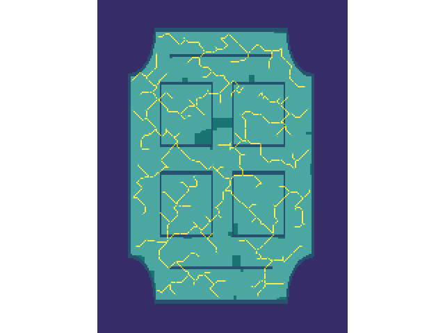
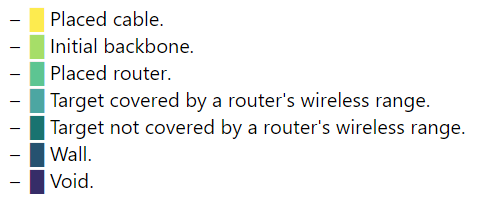

# Router Placement

## Group

- Eduardo Correia - up201806433
- João Cardoso - up201806531
- Ricardo Fontão - up201806317

## Work specification

The topic for this project is *Metaheuristics for Optimization/Decision Problems*.

The selected problem was *[Router Placement](https://storage.googleapis.com/coding-competitions.appspot.com/HC/2017/hashcode2017_final_task.pdf)* from Hash Code 2017's Final Round.

## How to run

To run the project simple run the `main.py` script with Python from the root folder.   
A menu prompt will appear asking for the user selection about which input file and algorithm they which to use.  
The `profile.ps1` might also be executed to profile the script execution.

## Project structure 

- 📁 **[docs](docs/)** - Relevant document files, such as the problem statement and project presentation slides.
- 📁 **[input](input/)** - Plain text input files containing each building's information.
- 📁 **[out](out/)** - Binary files resulting for project execution.
  - 📄 **[grid.png](out/grid.png)** - Plotting of resulting building grid with router and cable placement as well as wireless coverage.
  - 📄 **[stats](out/stats)** - Profiling statistics.
- 📁 **[src](src/)** - Source code for our project
  - 📄 **[graph.py](src/graph.py)** - Class containing a graph representation of the solution (nodes are routers, edges are cables) and an implementation of Kruskal's algorithm
  - 📄 **[grid.py](src/grid.py)** - Class containing a NumPy array representing the building grid.
  - 📄 **[in_out.py](src/in_out.py)** - Methods for user input and solution output.
  - 📄 **[main.py](src/main.py)** - Main file to be executed.
  - 📄 **[problem.py](src/problem.py)** - Class containing the relevant information of the problem and the different algorithms.
  - 📄 **[read_stats.py](src/read_stats.py)** - Auxiliary file to read the stats binary file and present it in a human-readable way.
  - 📄 **[solution.py](src/solution.py)** - Class representing a possible solution for our problem.

## Output 

```
Elapsed time of execution is 48.170578479766846 seconds.
Final score: 21511101
Covered cells: 21511
Placed routers: 284
```



